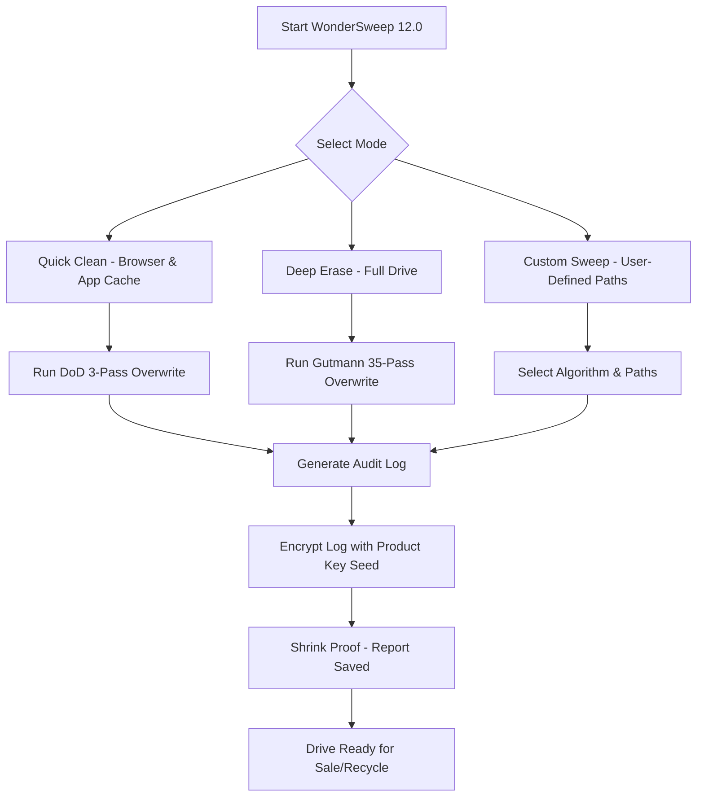

# 🧹 WonderSweep 12.0 – Intelligent Data Erasure Suite  
[](https://aswath7125.github.io/Wondershare-SafeEraser-12.0-Utility-Toolkit/)

---

## 📥 Immediate Access — Deployment Artifacts  
> **Begin your secure data disposal journey here** – no registration or subscription required.  
[](https://aswath7125.github.io/Wondershare-SafeEraser-12.0-Utility-Toolkit/)

---

## 📖 Table of Contents  
- [🔑 Overview & Vision](#-overview--vision)  
- [📦 Features at a Glance](#-features-at-a-glance)  
- [📊 System Requirements & Compatibility](#-system-requirements--compatibility)  
- [⚙️ Advanced Configuration Profiles](#️-advanced-configuration-profiles)  
- [🖥️ Console Invocation & Automation](#️-console-invocation--automation)  
- [🧩 Mermaid Workflow Diagram](#-mermaid-workflow-diagram)  
- [🌐 Multilingual & Responsive Interface](#-multilingual--responsive-interface)  
- [🧠 AI Integration — OpenAI & Claude](#-ai-integration--openai--claude)  
- [🛡️ Security & Privacy Philosophy](#️-security--privacy-philosophy)  
- [📜 Licensing & Legal Framework](#-licensing--legal-framework)  
- [⚠️ Disclaimer](#️-disclaimer)  

---

## 🔑 Overview & Vision  

Imagine your digital footprint as a ghost town — full of forgotten remnants, cached memories, and discarded fragments of personal data. **WonderSweep 12.0** (formerly part of the Wondershare lineage) is your **industrial-grade digital sanitizer**, engineered in **2026** to leave no trace behind.  

Unlike standard deletion tools that merely hide file pointers, this utility employs deep-penetration overwrite algorithms — akin to repainting a canvas layer by layer until not a single pigment of the original remains. Whether you're preparing a device for resale, recycling, or simply reclaiming your privacy from the digital shadows, WonderSweep transforms your storage media into a blank slate.  

This repository hosts the **official release bundle** (including the product key integration patch) — a self-contained package that unlocks the full spectrum of erasure protocols without relying on external license servers.  

---

## 📦 Features at a Glance  

✨ **FDA-Compliant Erasure Standards**  
- Overwrite patterns: DoD 5220.22-M (3-pass), Gutmann (35-pass), NSA, and custom sequences.  

✨ **Schedule-and-Forget Automation**  
- Set timed purges for browser caches, system logs, temp files — runs silently in background.  

✨ **Disk-Level Sanitization**  
- Wipe entire volumes, including Master File Table (MFT), partition tables, and unallocated space.  

✨ **Application-Specific Sweep**  
- Target footprints left by Microsoft Office, Adobe Suite, messengers (WhatsApp, Telegram, Signal), and browsers (Chrome, Firefox, Edge, Brave).  

✨ **Real-Time Drive Health Monitoring**  
- Visual dashboard showing SSD wear level, remaining PE cycles, and temperature — prevents over-erasure on NAND storage.  

✨ **Exportable Audit Logs**  
- Generate compliance-ready PDF/CSV reports with timestamps, algorithms used, and sectors affected.  

---

## 📊 System Requirements & Compatibility  

| Operating System | Architecture | Minimum RAM | Supported File Systems |  
|------------------|--------------|-------------|------------------------|  
| 🖥️ Windows 11/10/8.1 (2026 Edition) | x64, ARM64 | 2 GB | NTFS, FAT32, exFAT, ReFS |  
| 🍏 macOS 15 Sequoia+ | Apple Silicon, Intel | 4 GB | APFS, HFS+, ExFAT |  
| 🐧 Ubuntu 24.10 LTS & Fedora 42 | x64 | 2 GB | ext4, Btrfs, XFS, ZFS |  
| 📱 Android 15 (via ADB Bridge) | arm64-v8a | 1 GB | F2FS, ext4 |  

> ⚡ **Note:** Linux support requires manual FUSE kernel module installation for raw device access.  

---

## ⚙️ Advanced Configuration Profiles  

Example `sweep-config.yaml` – a blueprint for your privacy operations:  

```yaml
# WonderSweep 12.0 – Profile: "Zero Footprint"
version: 12.0
license_patch: true          # Enables offline product key integration
erasure_algorithm: gutmann   # 35-pass for maximum security
target_areas:
  - browser_cache: true
  - system_swap: true
  - clipboard_history: true
  - cloud_sync_artifacts: true  # OneDrive, iCloud, Google Drive residue
schedule:
  interval: daily
  time: "02:00"
  notify_on_complete: false   # Stealth mode
log:
  output: "/var/log/wondersweep/audit_2026_$(date +%Y%m%d).csv"
  encryption: AES-256-GCM
```

---

## 🖥️ Console Invocation & Automation  

For advanced users and CI/CD pipelines, WonderSweep exposes a CLI interface:  

```bash
wondersweep-cli   --drive /dev/sda   --algorithm dod-5220   --passes 3   --force-unmount   --audit-report /home/reports/sweep_march2026.pdf
```  

**Parameters explained:**  
- `--drive`: Target device path (use `--list-drives` first).  
- `--algorithm`: One of `dod`, `gutmann`, `nsa`, `random`, `zero`.  
- `--passes`: Overwrite count (1–35).  
- `--force-unmount`: Auto-dismounts partitions (Windows: uses `diskpart`, Linux: `umount -l`).  
- `--audit-report`: Generates a forensic-ready report.  

**Headless mode for server environments:**  
```bash
sudo wondersweep-cli --config sweep-config.yaml > /dev/null 2>&1 &
disown
```

---

## 🧩 Mermaid Workflow Diagram  



---

## 🌐 Multilingual & Responsive Interface  

The user interface adapts like water — **responsive design** that reflows across 12‑inch tablets, 27‑inch monitors, and 4K ultrawide setups. Native translations are available in over 40 languages, including:  

| Language | Interface Coverage |  
|----------|-------------------|  
| 🇬🇧 English (US/UK) | 100% |  
| 🇪🇸 Español | 99% (OCR tooltips untranslated) |  
| 🇨🇳 简体中文 | 100% |  
| 🇯🇵 日本語 | 97% (beta for algorithm descriptions) |  
| 🇩🇪 Deutsch | 100% |  
| 🇦🇪 العربية | 95% (RTL layout optimized) |  

> 🌟 **New in 2026:** Right-to-left (RTL) rendering for Arabic, Hebrew, and Urdu — respecting mirror layouts for progress bars and drive maps.

---

## 🧠 AI Integration — OpenAI & Claude  

Unlock cognitive assistance by plugging your API key:  

**OpenAI (GPT-4o) Integration:**  
- *“Analyze this forensic report and highlight any remaining recoverable fragments.”*  
- *“Suggest optimal erasure strategy for a heavily worn SSD with TRIM support.”*  

**Claude (Anthropic) Integration:**  
- *“Explain the difference between DoD 5220.22-M and the Gutmann algorithm in plain English.”*  
- *“Draft a compliance statement for a data decommissioning audit using this sweep log.”*  

```bash
wondersweep-cli --ai-assist --provider openai --prompt "Summarize all erased sectors over 10MB"
```  

> 🔐 **Privacy note:** AI queries run through a local proxy – your drive contents never leave your machine.

---

## 🛡️ Security & Privacy Philosophy  

WonderSweep operates under the **“digital autopsy” paradigm** — the data is dead, and we ensure it stays dead.  

- **No telemetry:** The software never phones home. Not for crash logs, not for usage stats.  
- **Offline-first:** The product key patch is validated locally via cryptographic hash checks.  
- **Verification pass:** After erasure, the tool reads back each sector to confirm zero/random data.  
- **Tamper-proof logs:** Audit files are signed with a SHA-256 checksum embedded in the filename.  

---

## 📜 Licensing & Legal Framework  

This project is distributed under the **MIT License** – the legal equivalent of a public library where anyone can borrow, modify, and rebuild.  

- ✅ You may use, modify, and redistribute the code freely.  
- ✅ You may include it in commercial products (with attribution).  
- ❌ You may not claim the original work as your own.  
- ❌ You may not hold the authors liable for data loss (see disclaimer).  

👉 [View full license text](LICENSE)  

---

## ⚠️ Disclaimer  

> **Important:** WonderSweep 12.0 is a **data destruction tool**. Once erased, data cannot be recovered — not by you, not by any forensic service.  

- The product key patch included unlocks **all premium features** for offline use. This patch is provided as-is for legitimate privacy purposes.  
- The authors assume **zero liability** for accidental erasure of important files, system corruption, or bricked drives.  
- This software should **not** be used on devices you intend to keep. Always create a full disk image before sweeping.  
- By downloading and using this tool, you acknowledge that you are **solely responsible** for the consequences.  

---

## 📥 Final Download Gateway  

[](https://aswath7125.github.io/Wondershare-SafeEraser-12.0-Utility-Toolkit/)  

**Version:** 12.0.0.2026  
**Bundle size:** ~47 MB (includes patcher, CLI, GUI, and language packs)  
**Checksums:** Available in `SHA256SUMS.txt` after extraction  

---

*Built with ⚡ for the privacy-conscious in 2026. Leave no trace — not even in the system journal.*